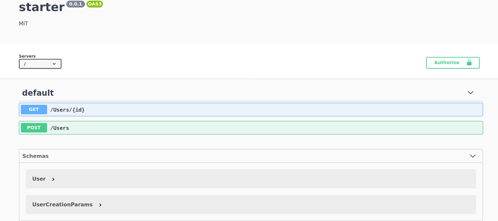
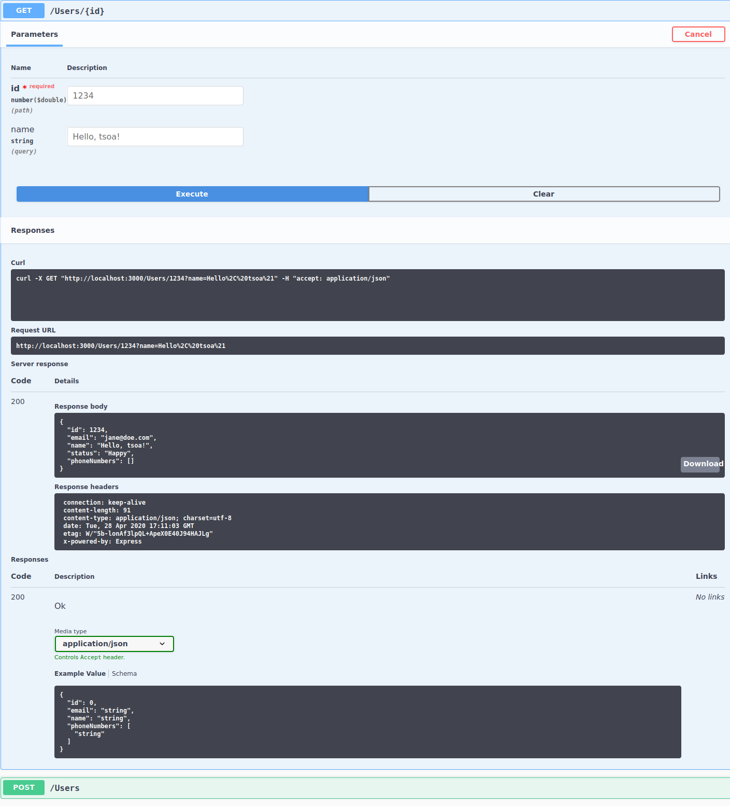

# Live reloading

::: warning COMPATIBILITY NOTE
This guide requires Node.js >= 8 and will target [express](https://expressjs.com).
We currently recommend using [Yarn](https://yarnpkg.com/en/), npm should work but was not tested.
We assume your setup is similar to the one recommended for [getting started](/getting-started)
:::

::: tip
We will use [nodemon](https://nodemon.io/) and [ts-node](https://github.com/TypeStrong/ts-node) for live reloading, but any tool that allows us to hook into the reloading process will do. Alternatives may, i.e. be a combination of `tsc -w` and triggering `tsoa spec-and-routes` using [`onchange`](https://www.npmjs.com/package/onchange).
:::

**What we will talk about:**

[[toc]]

## Reloading Code

### Installing nodemon and ts-node

```bash
yarn add -D nodemon ts-node concurrently
```

### Creating a nodemon config

Now, let's create a `nodemon.json` inside the root folder of our project that looks like this:

```json
{
  "exec": "ts-node src/server.ts",
  "watch": ["src"],
  "ext": "ts"
}
```

### Adding a dev script

Let's automatically start this setup with `yarn run dev`, and, while we're at it, a `build` and a `start` command in our `package.json`:

```diff
{
  "name": "starter",
  "version": "0.0.1",
+ "scripts: {
+   "dev": "concurrently \"nodemon\" \"nodemon -x tsoa spec-and-routes\"",
+   "build": "tsoa spec-and-routes && tsc"
+   "start": "node build/server.js"
+ },
  "dependencies": {
  // ...
}
```

## Supercharging our developer experience with SwaggerUI :rocket:

[SwaggerUI](https://swagger.io/tools/swagger-ui/) is a great tool to inspect our OAS and the requests our server can handle.

While other great tools like [Redoc](https://github.com/Redocly/redoc) serve beautiful documentation, a major upside of using SwaggerUI during development is the instant feedback via the "Try it out" feature.

In order to make sure we always get the latest documentation during _development_, we will import the latest OAS file (_build/swagger.json_) every time someone hits that endpoint.

::: danger
For performance reasons, importing the contents of the OAS file only once after starting the application is recommended in _production_.
:::

### Installing Swagger UI Express

This module allows you to serve auto-generated swagger-ui generated API docs from express, based on our OAS file. The result is living documentation for your API hosted from your API server via a route.

```bash
yarn add swagger-ui-express
yarn add -D @types/swagger-ui-express
```

### Exposing a `/doc` endpoint

Below the body-parser, let's add another handler **before the call to `RegisterRoutes(app)`**

```ts
// src/app.ts

import express, { Response as ExResponse, Request as ExRequest } from "express";
import swaggerUi from "swagger-ui-express";

// ...

app.use("/docs", swaggerUi.serve, async (_req: ExRequest, res: ExResponse) => {
  return res.send(
    swaggerUi.generateHTML(await import("../build/swagger.json"))
  );
});
```

::: tip
In order to dynamically import json files, set

```json
{
  "compilerOptions": {
    "resolveJsonModule": true
  }
}
```

in your `tsoa.conf` file.
:::

### Inspecting the Documentation

Now, when we navigate to [localhost:3000/docs](http://localhost:3000/docs), we should see a current reflection of our API.



### Sending Request through SwaggerUI

We can select Endponts, click the "Try it out" button and submit some data by filling out the form.
When we hit "Execute", that request will be sent to our server and the response will be displayed below the form.


